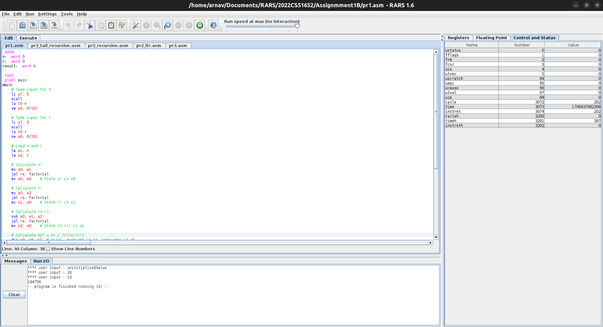
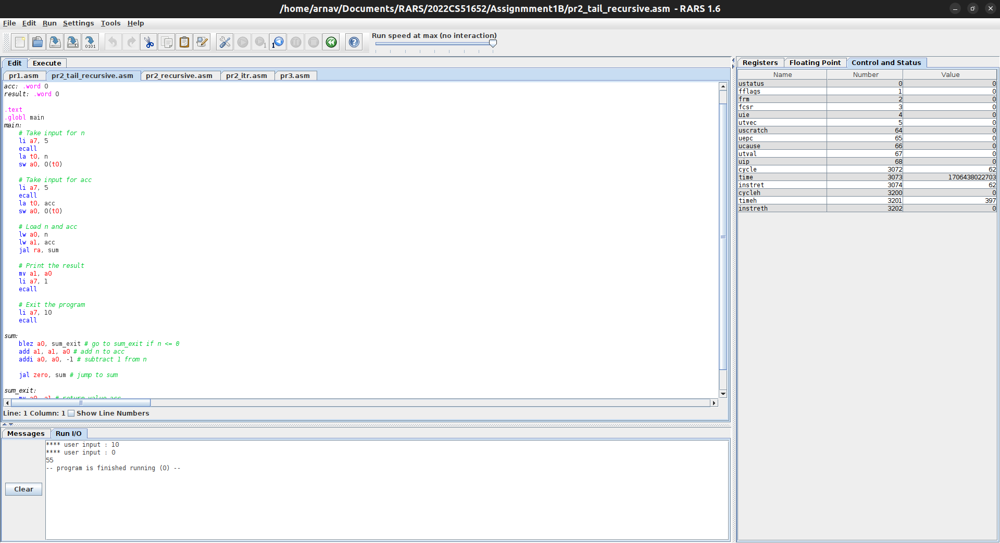
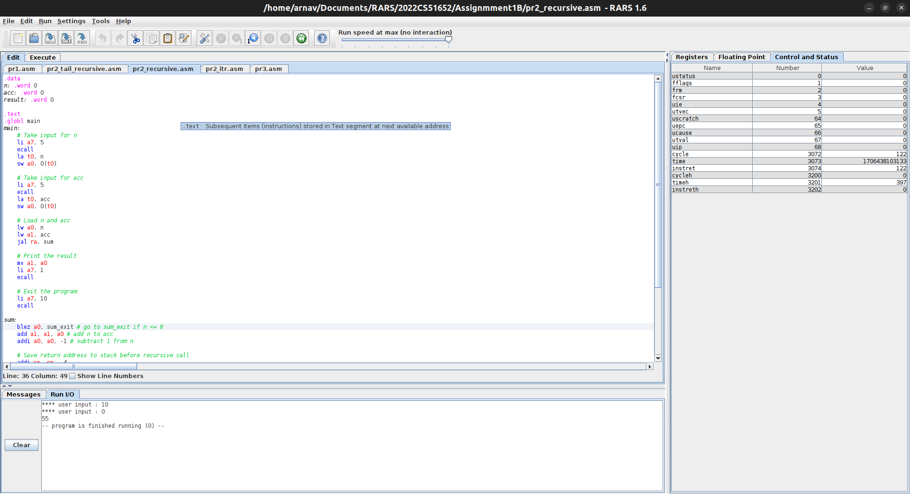
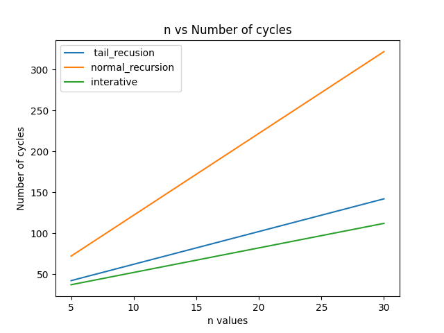
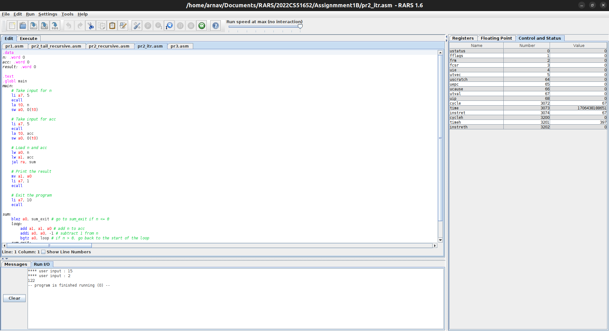
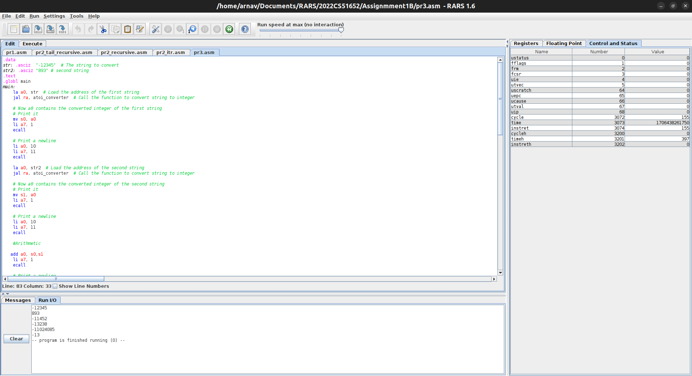

# Code Documentation

## Unique_Identifier : I have made a directory named "2022CS51652" which is my Entry number and inside that directory I have made a directory named "Assignment1B" which is the name of the assignment.


# Problem 1.
 

## Assumtions
- we take two inputs one for n and one for r in step by step manner
- The program is written in RISC-V assembly language and can be run on a RISC-V simulator or emulator
- The program assumes that the input values of n and r are positive integers that fit in the range of the word data type (32 bits)

## Data Section
- `n`: A variable that stores the value of n. It is initialized to 0.
- `r`: A variable that stores the value of r. It is initialized to 0.
- `result`: A variable that stores the result of the calculation. It is initialized to 0.

## Text Section

### Main Function
- The `main` function takes input for `n` and `r` and performs the calculation for nCr.
    1. Take input for `n` using system call 5 (read integer).
    2. Store the input value in the memory location `n`.
    3. Take input for `r` using system call 5 (read integer).
    4. Store the input value in the memory location `r`.
    5. Load the values of `n` and `r` from memory to registers `a1` and `a2`, respectively.
    6. Calculate `n!` by calling the `factorial` function with `n` as a parameter. Store the result in register `s0`.
    7. Calculate `r!` by calling the `factorial` function with `r` as a parameter. Store the result in register `s1`.
    8. Calculate `(n-r)!` by subtracting `r` from `n` and calling the `factorial` function with the result as a parameter. Store the result in register `s2`.
    9. Calculate `nCr` by dividing `n!` (`s0`) by `r!` (`s1`) and storing the quotient in register `a5`.
    10. Calculate the remainder of the division by dividing `nCr` (`a5`) by `(n-r)!` (`s2`) and storing the quotient in register `a6`.
    11. Print the value of `nCr` using system call 1 (print integer). The value is in register `a6`.
    12. Exit the program using system call 93 (exit program) with exit code 0.

### Factorial Function
- The `factorial` function calculates the factorial of a number.
    1. Initialize register `a3` to 1 to store the result.
    2. Start a loop: if the value in register `a0` (the parameter) is less than or equal to zero, exit the loop.
    3. Multiply the value in register `a3` by the value in register `a0`.
    4. Decrement the value in register `a0` by 1.
    5. Repeat steps 2-4 until the value in register `a0` is zero or negative.
    6. End the loop.
    7. Move the final result from register `a3` to register `a0`.
    8. Return from the function.

# Problem 2:

## Part A- Assumtions
  This code takes input for two variables `n` and `acc` (step by step from the I/O by the user), calculates the sum of `n` and `acc`, and then prints the result.




## .data Section

### Variables

- `n: .word 0`: This variable stores the value of `n`.
- `acc: .word 0`: This variable stores the value of `acc`.
- `result: .word 0`: This variable stores the result of the sum.

## .text Section

### main

The main function is the entry point of the program.

- Take input for `n`:
    - `li a7, 5`: Load immediate value 5 into register `a7` to indicate that we want to take input.
    - `ecall`: Execute the system call.
    - `la t0, n`: Load address of variable `n` into register `t0`.
    - `sw a0, 0(t0)`: Store the input value in memory address pointed by `t0`.

- Take input for `acc`:
    - `li a7, 5`: Load immediate value 5 into register `a7` to indicate that we want to take input.
    - `ecall`: Execute the system call.
    - `la t0, acc`: Load address of variable `acc` into register `t0`.
    - `sw a0, 0(t0)`: Store the input value in memory address pointed by `t0`.

- Load `n` and `acc`:
    - `lw a0, n`: Load the value of `n` into register `a0`.
    - `lw a1, acc`: Load the value of `acc` into register `a1`.

- Call the `sum` function:
    - `jal ra, sum`: Jump and link to the `sum` function, saving the return address in register `ra`.

- Print the result:
    - `mv a1, a0`: Move the sum result from register `a0` to register `a1`.
    - `li a7, 1`: Load immediate value 1 into register `a7` to indicate that we want to print an integer.
    - `ecall`: Execute the system call to print the integer.

- Exit the program:
    - `li a7, 10`: Load immediate value 10 into register `a7` to indicate that we want to exit the program.
    - `ecall`: Execute the system call to exit.

### sum

The sum function calculates the sum of `n` and `acc`.

- Check if `n` is less than or equal to 0. If true, go to `sum_exit`.
    - `blez a0, sum_exit`

- Add `n` to `acc`:
    - `add a1, a1, a0`

- Subtract 1 from `n`:
    - `addi a0, a0, -1`

- Jump to `sum`:
    - `jal zero, sum`

### sum_exit

The `sum_exit` label is reached when `n` is less than or equal to 0. The function stores the final sum in `acc`.

- Move the value of `acc` to `a0` (return value):
    - `mv a0, a1`

- Return from the function:
    - `ret`

## Part B (Normal Recursive): Explanation:-


This code is designed to calculate the sum of all positive integers from n down to 1 by using recursion.

Here is a line-by-line explanation of the code:

```assembly
blez a0, sum_exit # go to sum_exit if n <= 0
```
This line checks if the value in register a0 is less than or equal to 0. If it is, the code jumps to the label sum_exit, effectively ending the recursive function.

```assembly
add a1, a1, a0 # add n to acc
```
This line adds the value in register a0 to register a1, effectively summing up the values as the code recurses. The sum is stored in register a1.

```assembly
addi a0, a0, -1 # subtract 1 from n
```
This line subtracts 1 from the value in register a0, effectively decrementing the value of n as the code recurses.

```assembly
# Save return address to stack before recursive call
addi sp, sp, -4
sw ra, 0(sp)
```
These lines save the return address (value in register ra) to the stack before making a recursive call to the sum function. This ensures that the code knows where to return to after the recursive call is completed.

```assembly
jal ra, sum # jump to sum
```
This line jumps to the sum label, which refers to the start of the sum function. This initiates the recursive call.

```assembly
# Restore return address from stack after recursive call
lw ra, 0(sp)
addi sp, sp, 4
```
These lines restore the return address (value in register ra) from the stack after the recursive call is completed. This ensures that the code can correctly return to the previous point of execution.

```assembly
sum_exit:
    mv a0, a1 # return value acc
    ret
```
These lines define the sum_exit label and transfer the sum result (value in register a1) to register a0, which will be used as the return value for the function. The ret instruction is used to indicate the end of the function and return control to the calling code.




## Part C : (Iterative version): 
 again same input style of taking n and acc step by step from the I/O 


 ## Code Explanation

```assembly
blez a0, sum_exit   # Go to sum_exit if n <= 0
```
This instruction checks if the value stored in `a0` (n) is less than or equal to 0. If so, it skips the loop and jumps to `sum_exit`.

```assembly
loop:
    add a1, a1, a0   # Add n to the accumulator (a1)
    addi a0, a0, -1  # Subtract 1 from n
    bgtz a0, loop    # If n > 0, go back to the start of the loop
```
This is the main loop of the function. It adds the value of `n` to the accumulator (`a1`) using the `add` instruction. Then, it subtracts 1 from `n` using the `addi` instruction. If `n` is still greater than 0, it jumps back to the start of the loop (`loop`).

```assembly
sum_exit:
    mv a0, a1   # Move the value of the accumulator (a1) to a0 for return
    ret         # Return from the function
```
This part of the code is executed when the loop exits (i.e., when `n` becomes less than or equal to 0). It moves the value of the accumulator (`a1`) to the argument register (`a0`) using the `mv` instruction. Then, it returns from the function using the `ret` instruction.

## Code Summary
To summarize, this code calculates the sum of all positive integers up to a given value `n`. It does this by iterating over each positive integer from `n` down to 0, adding them to an accumulator (`a1`). The final sum is stored in `a1` and returned as the result of the function.


# Problem 3:


## Assumptions:
- The program is written in RISC-V assembly language and can be run on a RISC-V simulator or emulator
- I am taking the inputs in the code itself and printing results of all the possible arithmetic operations on them.


## Variables
- str: Stores the first string to convert ("-12345")
- str2: Stores the second string to convert ("893")

## Main Function
The main function is responsible for the execution of the code. It performs the following steps:
1. Loads the address of the first string into register a0.
2. Calls the "atoi_converter" function to convert the string to an integer.
3. Stores the converted integer in register s0.
4. Prints the converted integer.
5. Prints a newline character.
6. Loads the address of the second string into register a0.
7. Calls the "atoi_converter" function to convert the string to an integer.
8. Stores the converted integer in register s1.
9. Prints the converted integer.
10. Prints a newline character.
11. Performs arithmetic operations on the converted integers (addition, subtraction, multiplication, division).
12. Prints the results of the arithmetic operations.
13. Prints a newline character.
14. Exits the program.

## atoi_converter Function
The "atoi_converter" function takes a string as input and converts it to an integer. It uses the following algorithm:
1. Initializes registers t4, t5, and t1 with required values.
2. Checks if the first character of the string is a '-' or '+'. If it is '-', sets t1 to -1 and increments a0.
3. Enters a loop to iterate through each digit of the string.
4. Converts the character to its corresponding numerical value.
5. Checks if the value is within the valid range (0-9). If not, jumps to the "fail" label.
6. Accumulates the digit into t5 by multiplying it with 10 and adding it to t5.
7. Increments a0 to move to the next character and continues the loop.
8. When the loop finishes, sets a0 with the converted integer multiplied by the sign.
9. Returns the result.

## Conclusion
This code successfully converts strings to integers and performs arithmetic operations on them. It demonstrates the usage of registers and instructions in RISC-V assembly language.